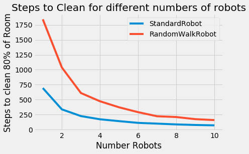

  🏠 Home
  🐍 Python

```python

print(sys.executable)
import ps2

from ps2_verify_movement37 import testRobotMovement
import ps2_visualize

```
    /home/jcmint/anaconda3/envs/learningenv/bin/python
# Robot cleaning simulations
I import the classes from ps2.py, including Position, RectangularRoom, Robot (and its subclasses StandardRobot and RandomWalkRobot). Nothing too complex here, just a hacky way of dealing with storing robot positions in a room represented as a NumPy Array.
## Classes in Action
```python
loc = ps2.Position(2, 2)
bad_loc = ps2.Position(10, 10)
room = ps2.RectangularRoom(6, 8)
print(room.isPositionInRoom(loc))
print(room.isPositionInRoom(bad_loc))
```

The robot is initialized in the 6 x 8 room with a set movement speed and at a random location. Upon initialization the tile it is on is marked as clean (so it starts out with one clean tile before moving). Then, moving again, it updates the position and the number of cleaned tiles. 
```python
robot = ps2.StandardRobot(room, 1)
print(robot.getRobotPosition())
print(robot.room.getNumCleanedTiles())
robot.updatePositionAndClean()
print(robot.getRobotPosition())
print(robot.room.getNumCleanedTiles())
```
    (1.00, 4.00)
    1
    (0.28, 4.69)
    2
The runSimulation function has args of the number of robots, speed, width, height, clean threshold and number of trials. The robots are initialized and trials are run until a set percent of the room has been covered by the robot, counting the number of steps taken, and returning the average of these steps over a number of trials. Here, we see that a randomly walking robot will take much longer than a straight "bouncing" robot to clean a room. 
```python
print(ps2.runSimulation(1, 1.0, 10, 10, 0.9, 30, ps2.StandardRobot))
print(ps2.runSimulation(1, 1.0, 10, 10, 0.9, 30, ps2.RandomWalkRobot))
```
    240.13333333333333
    614.1
Finally, we can run these trials for different combinations of the number of robots, or the aspect ratio (ratio of height to width), and see how many time steps it takes to clean the room. The second command hung up so I wasn't able to show all the data. 
```python

style.use('fivethirtyeight')
ps2.showPlot1("Steps to Clean for different numbers of robots", "Number Robots", "Steps to clean 80% of Room")
ps2.showPlot2("Steps to Clean for different room shapes (aspect ratio)", "Ratio of Width to Height", "Steps to clean 80% of Room")
```
    Plotting 1 robots...
    Plotting 2 robots...
    Plotting 3 robots...
    Plotting 4 robots...
    Plotting 5 robots...
    Plotting 6 robots...
    Plotting 7 robots...
    Plotting 8 robots...
    Plotting 9 robots...
    Plotting 10 robots...

    Plotting cleaning time for a room of width: 10 by height: 30
    Plotting cleaning time for a room of width: 11 by height: 27
    Plotting cleaning time for a room of width: 12 by height: 25
    Plotting cleaning time for a room of width: 13 by height: 23
    Plotting cleaning time for a room of width: 14 by height: 21
    Plotting cleaning time for a room of width: 15 by height: 20
    Plotting cleaning time for a room of width: 16 by height: 18
    Plotting cleaning time for a room of width: 17 by height: 17

## Appendix
Print out RectangularRoom, Robot, StandardRobot, RandomWalkRobot, RunSimulation classes 
### RectangularRoom
```python
class RectangularRoom(object):
    """

    tiles.
    A room has a width and a height and contains (width * height) tiles. At any
    particular time, each of these tiles is either clean or dirty.
    """
    def __init__(self, width, height):
        # Create array to represent room, with all False values
        self.width = width
        self.height = height
        self.grid = np.zeros((height, width), dtype=bool)
        """
        Initializes a rectangular room with the specified width and height.
        Initially, no tiles in the room have been cleaned.
        width: an integer > 0
        height: an integer > 0
        """
    def cleanTileAtPosition(self, pos):
        (c, r) = math.floor(pos.getX()), math.floor(pos.getY())
        # adjust position which begins at 1, 1, to grid which begins at 0, 0
        # This is pretty hacky, but for some reason a position that passed the isPositionInRoom is out of bounds..
        if (0  0)
        """
        # A position object is stored as self attribute
        self.room = room
        self.pos = self.room.getRandomPosition()
        self.room.cleanTileAtPosition(self.pos)
        self.angle = randint(0, 359)
        self.speed = speed
    def getRobotPosition(self):
        """
        Return the position of the robot.
        returns: a Position object giving the robot's position.
        """
        return self.pos

    def getRobotDirection(self):
        """
        Return the direction of the robot.
        returns: an integer d giving the direction of the robot as an angle in
        degrees, 0  0)
    speed: a float (speed > 0)
    width: an int (width > 0)
    height: an int (height > 0)
    min_coverage: a float (0  0)
    robot_type: class of robot to be instantiated (e.g. StandardRobot or
                RandomWalkRobot)
    """
    results = [None] * num_trials
    # Run number of trials and keep track with results list
    for trial in range(0, num_trials):
        my_room = RectangularRoom(width, height)
        my_bots = {}

        # Initialize robots
        for i in range(1, num_robots + 1):
            my_bots[i] = robot_type(my_room, speed)
        steps = 0
        while my_room.getNumCleanedTiles()/my_room.getNumTiles() < min_coverage:
            for bot in my_bots.values():
                bot.room = my_room
                bot.updatePositionAndClean()
                my_room = bot.room
            steps += 1
            if ((toprint) & (steps%100 == 0)):
                print("Took Step ", steps)
        results[trial] = steps
        if toprint:
            print("Finished Trial: ", trial)
    return sum(results)/len(results)
```