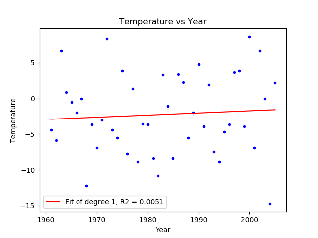
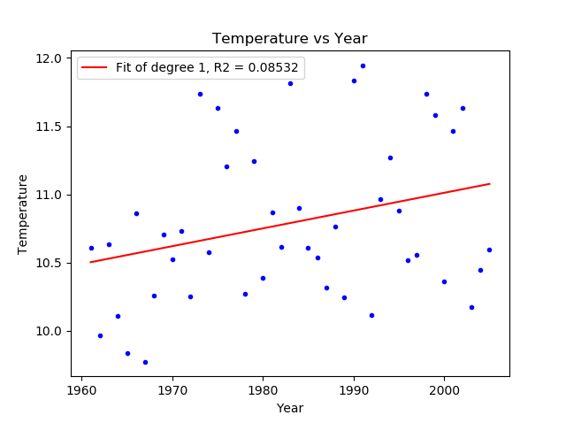

  🏠 Home
  🐍 Python

# Fitting and evaluating linear models
This problem set had me write functions to generate various linear models of various degrees, evaluate based on R squared and plot the results. These are the results, training a regression line of temperature vs year based on a single yearly date (Jan 10) as representative data, or the entire averaged yearly data. 
## Results for single date model

## Results for averaged yearly data 

## Code
```python
def generate_models(x, y, degs):
    my_models = [None] * len(degs)
    for index, degree in enumerate(degs):
        my_models[index] = np.polyfit(x, y, degree)
    return my_models
def r_squared(y, estimated):
    mean = sum(y)/len(y)
    return 1 - sum((y[i] - estimated[i])**2 for i in range(len(y))) /\
        sum((y[i] - mean)**2 for i in range(len(y)))
def evaluate_models_on_training(x, y, models):
    plt.plot(x , y, '.', color='blue')
    plt.ylabel('Temperature')
    plt.xlabel('Year')
    plt.title('Temperature vs Year')
    for model in models:
        # y_pred = [sum(coeff * x_val ** power for power, coeff in enumerate(model)) for x_val in x]
        y_pred = np.polyval(model, x)
        r_2 = r_squared(y, y_pred)
        plt.plot(x, y_pred, '-', color='red', \
        label = 'Fit of degree '\
            + str(len(model) - 1)\
                +', R2 = ' + str(round(r_2, 5)))
    plt.legend()
    plt.show()
```