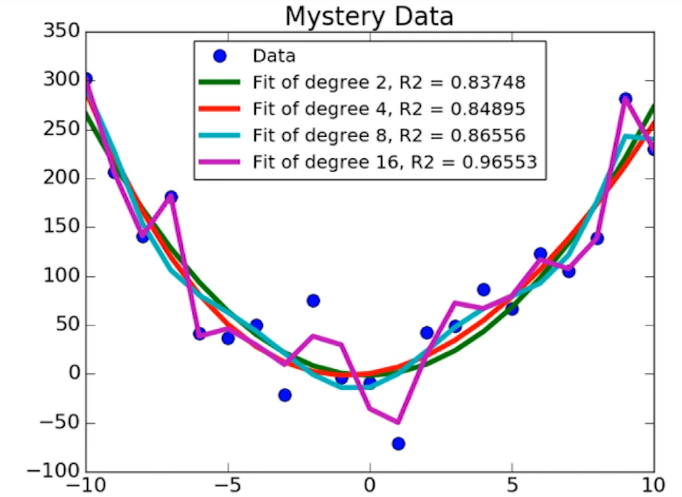
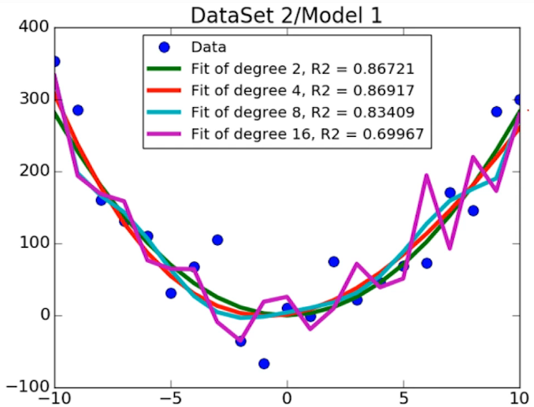

# Experimental Data and Modeling

Applying statistics to experimental conclusions, such as from observations or simulations, can help assess whether conclusions are significant. When trying to mathematically define empirically observable phenomena (such as a spring), there are often model parameters and constants that have to be estimated. These parameters can be estimated by conducting careful measurements of how the behavior changes under different conditions. By broadening the range of conditions the system is subject to, the observed behaviors will also vary more, helping to draw better conclusions about how to define the relationship and build a model.

When fitting a model, a common quantitative assessment of model fit is to use the least squares objective function, which is an optimization problem for minimizing the sum of squares of the y error between each data point and the model's predicted line.

## Fitting a model to data

One example of model fitting is to use `pylab.polyfit(x, y, 1)`. Then, you can use the fitted model object and the `pylab.polyval(model, x)` to predict points. The overall best way to assess the goodness of fit is to use R squared, which is a measurement of the data variability captured by the model, without influence by the magnitude of the data itself (e.g. the mean of x or y). R squared will be between 0 and 1 for in-range data, with higher values being better. However, trying to increase R squared within the existing data's range may lead to overfitting to the existing data and poor generalization to test input values that are outside the range of training values.

## Overfitting

One way to test whether a model generalizes to non training data is to use cross validation, by testing model performance on a separate data set that was not used to train it in the first place. We would expect the R squared to be lower when testing a model on unseen data, but a value that is substantially lower than that found on training data is alarming.

In the above image, the highest order polynomial model seemed to fit the noise from the original training data, rather than the actual underlying trend in the data. Essentially, adding complexity by using higher order polynomials allows fitting more complex trends, but also allows unwittingly fitting noise.

## Cross Validation

- **Leave one out cross validation** - suitable for small training sets
- **K-fold cross validation** - partition data into k folds, training on k-1 sets at a time and testing on one set. Repeat the process for all k-1 combinations of sets.
- **Sample indices** to use for training

## Conclusions

- Choosing an overly complex model can lead to overfitting, by fitting the noise in the training data set rather than the true underlying trends.
- Choosing an insufficiently complex model will lead to bias - where the model is too inflexible and is 'stuck' in only being able to model a type of variability.
