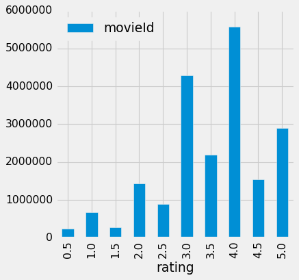

  🏠 Home
  🐍 Python

```python

print(sys.executable)
from IPython.core.interactiveshell import InteractiveShell
InteractiveShell.ast_node_interactivity = "all"
InteractiveShell.colors = "Linux"
InteractiveShell.separate_in = 0

import matplotlib.pyplot as plt

style.use('fivethirtyeight')
import os, sys
```
    /home/jcmint/anaconda3/envs/learningenv/bin/python
```python
os.chdir(sys.path[0]) # Change dir to the folder this .ipynb file is in
print(os.listdir('../../../../data/w4pd'))
movies = pd.read_csv('../../../../data/w4pd/movies.csv')
tags = pd.read_csv('../../../../data/w4pd/tags.csv')
ratings = pd.read_csv('../../../../data/w4pd/ratings.csv')
```
    ['genome-scores.csv', 'genome-tags.csv', 'Icon\r', 'links.csv', 'movies.csv', 'ratings.csv', 'README.txt', 'tags.csv']
# Manipulating Data
```python
ratings.head(5)
```

|  | userId | movieId | rating | timestamp |
| --- | --- | --- | --- | --- |
| 0 | 1 | 2 | 3.5 | 1112486027 |
| 1 | 1 | 29 | 3.5 | 1112484676 |
| 2 | 1 | 32 | 3.5 | 1112484819 |
| 3 | 1 | 47 | 3.5 | 1112484727 |
| 4 | 1 | 50 | 3.5 | 1112484580 |

## Aggregating and Grouping
**Code:** `df[['col1', 'col2']].groupby('col1')` 
It makes sense to calculate different aggregate stats for different groupings. `groupby` doesn't do any aggregate calculations by default - it just reorders the df so that the same values in the grouping column are all consecutive. You can also use .count() on a grouping. 
```python
user_ratings = ratings[['userId', 'rating']].groupby('userId').mean() 
user_ratings.head()
movie_ratings = ratings[['movieId', 'rating']].groupby('movieId').mean() 
movie_ratings.head()
```

|  | rating |
| --- | --- |
| userId |  |
| 1 | 3.742857 |
| 2 | 4.000000 |
| 3 | 4.122995 |
| 4 | 3.571429 |
| 5 | 4.272727 |

|  | rating |
| --- | --- |
| movieId |  |
| 1 | 3.921240 |
| 2 | 3.211977 |
| 3 | 3.151040 |
| 4 | 2.861393 |
| 5 | 3.064592 |

## Plotting aggregated data
Generate a histogram of movie ratings (so group by the ratings column). 
```python
ratings_hist = ratings[['movieId', 'rating']].groupby('rating').count()
print(ratings_hist)
# Now we plot

ratings_hist.plot(kind = "bar", figsize = (5, 5)) 
plt.show() 
```

    0.5      239125
    1.0      680732
    1.5      279252
    2.0     1430997
    2.5      883398
    3.0     4291193
    3.5     2200156
    4.0     5561926
    4.5     1534824
    5.0     2898660


## Filtering
Encode a filter that saves the indices of a dataframe (for which a condition is true), and then apply the filter as a mask to extract the desired values. (This can also apply to 3D image matrices).
Below - find the most active raters (count of userId groupings of the ratings df). Looking at the mean and standard dev set the cutoff at 2000! movie ratings. 
```python
active_raters = ratings[['userId', 'rating']].groupby('userId').count()
print(active_raters.mean(), active_raters.std())
highly_active_raters = active_raters[active_raters['rating'] > 2000]
print(highly_active_raters.shape[0])
```
    rating    144.41353
    dtype: float64 rating    230.267257
    dtype: float64
    255
### Filtering based on string matching
Using the movies dataframe, filter for movies with Animation as a genre:
```python
movies.head()
is_anime = movies['genres'].str.contains('Ani*') 
the_anime = movies[is_anime]
the_anime.shape[0]
the_anime.head()
```

|  | movieId | title | genres |
| --- | --- | --- | --- |
| 0 | 1 | Toy Story (1995) | Adventure|Animation|Children|Comedy|Fantasy |
| 1 | 2 | Jumanji (1995) | Adventure|Children|Fantasy |
| 2 | 3 | Grumpier Old Men (1995) | Comedy|Romance |
| 3 | 4 | Waiting to Exhale (1995) | Comedy|Drama|Romance |
| 4 | 5 | Father of the Bride Part II (1995) | Comedy |

    1027

|  | movieId | title | genres |
| --- | --- | --- | --- |
| 0 | 1 | Toy Story (1995) | Adventure|Animation|Children|Comedy|Fantasy |
| 12 | 13 | Balto (1995) | Adventure|Animation|Children |
| 47 | 48 | Pocahontas (1995) | Animation|Children|Drama|Musical|Romance |
| 236 | 239 | Goofy Movie, A (1995) | Animation|Children|Comedy|Romance |
| 241 | 244 | Gumby: The Movie (1995) | Animation|Children |

# Joining Data
Combining data from multiple dataframes or sources. 
## Stack dataframes
**Code:** `pd.concat([df1, df2])`
The stacking is not really ideal in this scenario - it would be better to stack df's that have matched columns and data types.
```python
stack_1 = pd.concat([tags.head(), movies.head()])
stack_1
```
    /home/jcmint/anaconda3/envs/learningenv/lib/python3.7/site-packages/ipykernel_launcher.py:1: FutureWarning: Sorting because non-concatenation axis is not aligned. A future version
    of pandas will change to not sort by default.

    To accept the future behavior, pass 'sort=False'.

    To retain the current behavior and silence the warning, pass 'sort=True'.

      """Entry point for launching an IPython kernel.

|  | genres | movieId | tag | timestamp | title | userId |
| --- | --- | --- | --- | --- | --- | --- |
| 0 | NaN | 4141 | Mark Waters | 1.240597e+09 | NaN | 18.0 |
| 1 | NaN | 208 | dark hero | 1.368150e+09 | NaN | 65.0 |
| 2 | NaN | 353 | dark hero | 1.368150e+09 | NaN | 65.0 |
| 3 | NaN | 521 | noir thriller | 1.368150e+09 | NaN | 65.0 |
| 4 | NaN | 592 | dark hero | 1.368150e+09 | NaN | 65.0 |
| 0 | Adventure|Animation|Children|Comedy|Fantasy | 1 | NaN | NaN | Toy Story (1995) | NaN |
| 1 | Adventure|Children|Fantasy | 2 | NaN | NaN | Jumanji (1995) | NaN |
| 2 | Comedy|Romance | 3 | NaN | NaN | Grumpier Old Men (1995) | NaN |
| 3 | Comedy|Drama|Romance | 4 | NaN | NaN | Waiting to Exhale (1995) | NaN |
| 4 | Comedy | 5 | NaN | NaN | Father of the Bride Part II (1995) | NaN |

## Stack dataframes (append method)
**Code:** `df1.append(df2)`
This gives the same results as using stack. 
```python
append_1 = tags.head().append(movies.head())
append_1 
```
    /home/jcmint/anaconda3/envs/learningenv/lib/python3.7/site-packages/pandas/core/frame.py:6692: FutureWarning: Sorting because non-concatenation axis is not aligned. A future version
    of pandas will change to not sort by default.

    To accept the future behavior, pass 'sort=False'.

    To retain the current behavior and silence the warning, pass 'sort=True'.

      sort=sort)

|  | genres | movieId | tag | timestamp | title | userId |
| --- | --- | --- | --- | --- | --- | --- |
| 0 | NaN | 4141 | Mark Waters | 1.240597e+09 | NaN | 18.0 |
| 1 | NaN | 208 | dark hero | 1.368150e+09 | NaN | 65.0 |
| 2 | NaN | 353 | dark hero | 1.368150e+09 | NaN | 65.0 |
| 3 | NaN | 521 | noir thriller | 1.368150e+09 | NaN | 65.0 |
| 4 | NaN | 592 | dark hero | 1.368150e+09 | NaN | 65.0 |
| 0 | Adventure|Animation|Children|Comedy|Fantasy | 1 | NaN | NaN | Toy Story (1995) | NaN |
| 1 | Adventure|Children|Fantasy | 2 | NaN | NaN | Jumanji (1995) | NaN |
| 2 | Comedy|Romance | 3 | NaN | NaN | Grumpier Old Men (1995) | NaN |
| 3 | Comedy|Drama|Romance | 4 | NaN | NaN | Waiting to Exhale (1995) | NaN |
| 4 | Comedy | 5 | NaN | NaN | Father of the Bride Part II (1995) | NaN |

## Inner join with pd.concat
**Code:** `pd.concat` with `axis = 1, join = "inner"`
This is NOT the same as an INNER JOIN ON tb1.field1 = tbl2.field1 as it would be in SQL
As a result, this isn't particularly useful since you're not matching as you combine data. 
```python
joined = pd.concat([tags.head(), movies.head()], axis = 1, join = "inner")

```

|  | userId | movieId | tag | timestamp | movieId | title | genres |
| --- | --- | --- | --- | --- | --- | --- | --- |
| 0 | 18 | 4141 | Mark Waters | 1240597180 | 1 | Toy Story (1995) | Adventure|Animation|Children|Comedy|Fantasy |
| 1 | 65 | 208 | dark hero | 1368150078 | 2 | Jumanji (1995) | Adventure|Children|Fantasy |
| 2 | 65 | 353 | dark hero | 1368150079 | 3 | Grumpier Old Men (1995) | Comedy|Romance |
| 3 | 65 | 521 | noir thriller | 1368149983 | 4 | Waiting to Exhale (1995) | Comedy|Drama|Romance |
| 4 | 65 | 592 | dark hero | 1368150078 | 5 | Father of the Bride Part II (1995) | Comedy |

## The actual inner join
**Code:** `df1.merge(df2, on = 'col1', how='inner')`
The **actual** INNER JOIN
Below, inner jon the aggregated mean movie_ratings and a new movie_counts (the number of ratings per movie). Then inner join again to `movies` dataframe.
```python
movie_counts = ratings[['movieId', 'rating']].groupby('movieId').count() 
movie_ratings.head()
movie_counts.head()
merged_1 = movie_ratings.merge(movie_counts, on = 'movieId', how='inner')
merged_1.head()
```

|  | rating |
| --- | --- |
| movieId |  |
| 1 | 3.921240 |
| 2 | 3.211977 |
| 3 | 3.151040 |
| 4 | 2.861393 |
| 5 | 3.064592 |

|  | rating |
| --- | --- |
| movieId |  |
| 1 | 49695 |
| 2 | 22243 |
| 3 | 12735 |
| 4 | 2756 |
| 5 | 12161 |

|  | rating_x | rating_y |
| --- | --- | --- |
| movieId |  |  |
| 1 | 3.921240 | 49695 |
| 2 | 3.211977 | 22243 |
| 3 | 3.151040 | 12735 |
| 4 | 2.861393 | 2756 |
| 5 | 3.064592 | 12161 |

## Chaining together merges
Chained merging on a merged dataframe without a new object is possible, but becomes unreadable after a few in a row:
```python
merged_2 = merged_1.merge(movies, on = 'movieId', how='inner')
merged_3 = movie_ratings.merge(movie_counts, on = 'movieId', how='inner').merge(movies, on = 'movieId', how='inner')
merged_2.head() 
merged_3.head()
```

|  | movieId | rating_x | rating_y | title | genres |
| --- | --- | --- | --- | --- | --- |
| 0 | 1 | 3.921240 | 49695 | Toy Story (1995) | Adventure|Animation|Children|Comedy|Fantasy |
| 1 | 2 | 3.211977 | 22243 | Jumanji (1995) | Adventure|Children|Fantasy |
| 2 | 3 | 3.151040 | 12735 | Grumpier Old Men (1995) | Comedy|Romance |
| 3 | 4 | 2.861393 | 2756 | Waiting to Exhale (1995) | Comedy|Drama|Romance |
| 4 | 5 | 3.064592 | 12161 | Father of the Bride Part II (1995) | Comedy |

|  | movieId | rating_x | rating_y | title | genres |
| --- | --- | --- | --- | --- | --- |
| 0 | 1 | 3.921240 | 49695 | Toy Story (1995) | Adventure|Animation|Children|Comedy|Fantasy |
| 1 | 2 | 3.211977 | 22243 | Jumanji (1995) | Adventure|Children|Fantasy |
| 2 | 3 | 3.151040 | 12735 | Grumpier Old Men (1995) | Comedy|Romance |
| 3 | 4 | 2.861393 | 2756 | Waiting to Exhale (1995) | Comedy|Drama|Romance |
| 4 | 5 | 3.064592 | 12161 | Father of the Bride Part II (1995) | Comedy |

# Combining everything
After merging three dataframes with aggregated ratings and rating counts data, we can apply a filter - the `is_anime` which was a string filter, as well as a new filter for movies that were both highly rated (more than 4) and actively rated (more than 2000 ratings). 
```python
ani_summary = merged_3[is_anime & (merged_3['rating_x'] > 4) & (merged_3['rating_y'] > 2000)]
ani_summary
ani_summary.shape[0]
```
    /home/jcmint/anaconda3/envs/learningenv/lib/python3.7/site-packages/ipykernel_launcher.py:1: UserWarning: Boolean Series key will be reindexed to match DataFrame index.
      """Entry point for launching an IPython kernel.

|  | movieId | rating_x | rating_y | title | genres |
| --- | --- | --- | --- | --- | --- |
| 708 | 720 | 4.109473 | 8171 | Wallace &amp; Gromit: The Best of Aardman Animatio... | Adventure|Animation|Comedy |
| 732 | 745 | 4.167315 | 12073 | Wallace &amp; Gromit: A Close Shave (1995) | Animation|Children|Comedy |
| 1125 | 1148 | 4.181068 | 15022 | Wallace &amp; Gromit: The Wrong Trousers (1993) | Animation|Children|Comedy|Crime |
| 1197 | 1223 | 4.066765 | 7781 | Grand Day Out with Wallace and Gromit, A (1989) | Adventure|Animation|Children|Comedy|Sci-Fi |
| 2914 | 3000 | 4.096299 | 9564 | Princess Mononoke (Mononoke-hime) (1997) | Action|Adventure|Animation|Drama|Fantasy |
| 3340 | 3429 | 4.120696 | 2585 | Creature Comforts (1989) | Animation|Comedy |
| 5519 | 5618 | 4.203810 | 13466 | Spirited Away (Sen to Chihiro no kamikakushi) ... | Adventure|Animation|Fantasy |
| 5591 | 5690 | 4.089744 | 3198 | Grave of the Fireflies (Hotaru no haka) (1988) | Animation|Drama|War |
| 5872 | 5971 | 4.149481 | 5489 | My Neighbor Totoro (Tonari no Totoro) (1988) | Animation|Children|Drama|Fantasy |
| 6251 | 6350 | 4.061917 | 3537 | Laputa: Castle in the Sky (Tenkû no shiro Rapy... | Action|Adventure|Animation|Children|Fantasy|Sc... |
| 6987 | 7099 | 4.092082 | 3334 | Nausicaä of the Valley of the Wind (Kaze no ta... | Adventure|Animation|Drama|Fantasy|Sci-Fi |

    11
In conclusion, it seems that the two big categories were Wallance & Gromit and Anime, which makes sense, although it misses some Pixar and Disney films which I would've expected to make the cut.