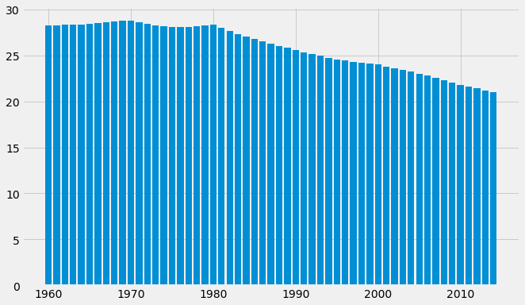
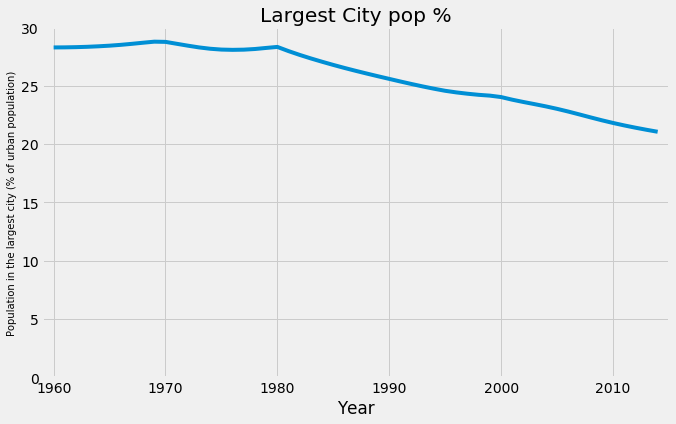
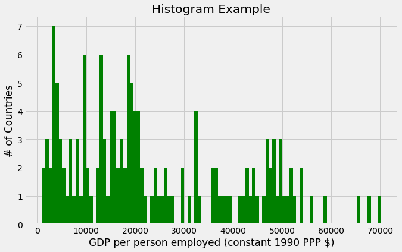

  🏠 Home
  🐍 Python

```python

print(sys.executable)
from IPython.core.interactiveshell import InteractiveShell
InteractiveShell.ast_node_interactivity = "all"
InteractiveShell.colors = "Linux"
InteractiveShell.separate_in = 0

import matplotlib.pyplot as plt

style.use('fivethirtyeight')
import os, sys
```
    /home/jcmint/anaconda3/envs/learningenv/bin/python
# Data Visualization
Simplifies data interpretation. 
**Conceptual or data-driven**
For example, a theoretical plot - supply & demand, stress & strain. 
**Declarative or Exploratory**
Presentation of real-world data to reach a final conclusion. 
Exploratory is just for quick analysis rather than polishing the visualization itself. 
**Principles of Good Design**
* Trustworthy 
 * Evidence for a figure should be in the data. E.g. zooming in on an axis to exaggerate a change in a value is not trustworthy. 
* Accessible
 * Make visuals appropriate for audience, and to fulfill its intended purpose
* Elegant
## Visualization libraries - Matplotlib
Matplotlib is the main go-to for day to day visualization; others have specialization for specific use cases.
Common components include a chart type, axes ranges and labels, figure labels, legend, aesthetics and annotations. 
* Using [the Indicators](https://www.kaggle.com/worldbank/world-development-indicators/version/2#Indicators.csv) data set. 
```python
indicators = pd.read_csv('../../../../data/w5vis/Indicators.csv')
# no need to run often, so separate into its own code cell. 
```
```python
# print head of dataframe
indicators.head()
# unique country names
countries = indicators['CountryName'].unique().tolist()
print("country num:", len(countries))
# number of country codes
cocodes = indicators['CountryCode'].unique().tolist()
print("country codes:", len(cocodes))
# how many indicators? 
inds = indicators['IndicatorName'].unique().tolist()
print("indicators:", len(inds))
# years and range of data
years = indicators['Year'].unique().tolist()
print(len(years), min(years), "to", max(years))
```

|  | CountryName | CountryCode | IndicatorName | IndicatorCode | Year | Value |
| --- | --- | --- | --- | --- | --- | --- |
| 0 | Arab World | ARB | Adolescent fertility rate (births per 1,000 wo... | SP.ADO.TFRT | 1960 | 1.335609e+02 |
| 1 | Arab World | ARB | Age dependency ratio (% of working-age populat... | SP.POP.DPND | 1960 | 8.779760e+01 |
| 2 | Arab World | ARB | Age dependency ratio, old (% of working-age po... | SP.POP.DPND.OL | 1960 | 6.634579e+00 |
| 3 | Arab World | ARB | Age dependency ratio, young (% of working-age ... | SP.POP.DPND.YG | 1960 | 8.102333e+01 |
| 4 | Arab World | ARB | Arms exports (SIPRI trend indicator values) | MS.MIL.XPRT.KD | 1960 | 3.000000e+06 |

    country num: 247
    country codes: 247
    indicators: 1344
    56 1960 to 2015
This is actually a 4D dataset, with country, indicator, year and value. I would say its combination of the first three that match each value. 
```python
# pick a random indicator for a random country
hist_indicator = 'Population in the largest city'
hist_country = 'MEX'
# grab data 
data = indicators[indicators['IndicatorName'].str.contains(hist_indicator) & indicators['CountryCode'].str.contains(hist_country)]     
data.head()
```

|  | CountryName | CountryCode | IndicatorName | IndicatorCode | Year | Value |
| --- | --- | --- | --- | --- | --- | --- |
| 15382 | Mexico | MEX | Population in the largest city (% of urban pop... | EN.URB.LCTY.UR.ZS | 1960 | 28.280377 |
| 40837 | Mexico | MEX | Population in the largest city (% of urban pop... | EN.URB.LCTY.UR.ZS | 1961 | 28.287121 |
| 68643 | Mexico | MEX | Population in the largest city (% of urban pop... | EN.URB.LCTY.UR.ZS | 1962 | 28.305114 |
| 97213 | Mexico | MEX | Population in the largest city (% of urban pop... | EN.URB.LCTY.UR.ZS | 1963 | 28.334391 |
| 126125 | Mexico | MEX | Population in the largest city (% of urban pop... | EN.URB.LCTY.UR.ZS | 1964 | 28.378130 |

## Bar Plot
```python
fig, axis = plt.subplots()
fig.set_size_inches(10, 6)
plt.bar(data['Year'].values, data['Value'].values)
plt.show();
```

## Line Plot
```python
fig, axis = plt.subplots()
fig.set_size_inches(10, 6)
plt.plot(data['Year'].values, data['Value'].values)
plt.xlabel('Year')
plt.ylabel(data['IndicatorName'].iloc[0], fontsize=10)
plt.title('Largest City pop %')
plt.axis([1959, 2015,0,30])
plt.show();
```

## Histogram
```python
# Prep data for histogram

cond_gdp_worker_ppp = indicators['IndicatorName'] == 'GDP per person employed (constant 1990 PPP $)'
cond_2014 = indicators['Year'] == 2014
data_2 = indicators[cond_gdp_worker_ppp & cond_2014]
display(data_2.head())
# add a semicolon to last plt in a cell to avoid printing extra info
fig, axis = plt.subplots()
fig.set_size_inches(10, 6)
plt.hist(data_2['Value'].values, 100, density=False, facecolor='green');
plt.xlabel(data_2['IndicatorName'].iloc[0]);
plt.ylabel('# of Countries');
plt.title('Histogram Example');
```

|  | CountryName | CountryCode | IndicatorName | IndicatorCode | Year | Value |
| --- | --- | --- | --- | --- | --- | --- |
| 5534383 | Arab World | ARB | GDP per person employed (constant 1990 PPP $) | SL.GDP.PCAP.EM.KD | 2014 | 16767.221871 |
| 5534893 | Central Europe and the Baltics | CEB | GDP per person employed (constant 1990 PPP $) | SL.GDP.PCAP.EM.KD | 2014 | 25167.333899 |
| 5535240 | East Asia &amp; Pacific (all income levels) | EAS | GDP per person employed (constant 1990 PPP $) | SL.GDP.PCAP.EM.KD | 2014 | 18639.269885 |
| 5535541 | East Asia &amp; Pacific (developing only) | EAP | GDP per person employed (constant 1990 PPP $) | SL.GDP.PCAP.EM.KD | 2014 | 15755.489075 |
| 5536004 | Euro area | EMU | GDP per person employed (constant 1990 PPP $) | SL.GDP.PCAP.EM.KD | 2014 | 45073.794771 |


## Scatterplot
#### Data Prep for Scatterplot
Now, plot GDP per worker vs percent urbanization for all countries for all years of data 
* No need to aggregate - just use the 'World' CountryName 
* 2 Filters: 
     * GDP per worker, GDP per person employed (constant 1990 PPP $)
     * percent urbanization, Urban population (% of total)
* Only pull year and value - other columns aren't needed
* Inner join tables on Year. Merge seems to automatically drop missing years where the first dataframe had no values
* Plot urbanization on x, gdp per person on y
```python
cond_world = indicators['CountryName'] == 'World'
gdp_worker_ppp = indicators[cond_gdp_worker_ppp & cond_world][['Year', 'Value']]
cond_3 = indicators['IndicatorName'] == 'Urban population (% of total)'
urban_perc = indicators[cond_3 & cond_world][['Year', 'Value']]
data_3 = urban_perc.merge(gdp_worker_ppp, on = 'Year', how = 'inner')
display(gdp_worker_ppp.head(), urban_perc.head(), data_3.head())
len(gdp_worker_ppp), len(urban_perc), len(data_3)
```

|  | Year | Value |
| --- | --- | --- |
| 2012906 | 1991 | 12056.692883 |
| 2129349 | 1992 | 12144.729023 |
| 2251054 | 1993 | 12242.591709 |
| 2374887 | 1994 | 12430.524713 |
| 2501760 | 1995 | 12767.091788 |

|  | Year | Value |
| --- | --- | --- |
| 3491 | 1960 | 33.557608 |
| 27221 | 1961 | 34.073235 |
| 54067 | 1962 | 34.517820 |
| 82472 | 1963 | 34.908136 |
| 111146 | 1964 | 35.303686 |

|  | Year | Value_x | Value_y |
| --- | --- | --- | --- |
| 0 | 1991 | 43.285793 | 12056.692883 |
| 1 | 1992 | 43.624850 | 12144.729023 |
| 2 | 1993 | 43.982123 | 12242.591709 |
| 3 | 1994 | 44.334518 | 12430.524713 |
| 4 | 1995 | 44.703049 | 12767.091788 |

    (24, 55, 24)
#### Scatterplot generation
```python
fig, axis = plt.subplots()
# Grid lines, Xticks, Xlabel, Ylabel
axis.yaxis.grid(True)
axis.set_title('GDP per person employed vs Urban population',fontsize=16)
axis.set_xlabel('Urban population (% of total)',fontsize=10)
axis.set_ylabel('GDP per person employed (constant 1990 PPP $)',fontsize=10)
fig.set_size_inches(10, 6)
X = data_3['Value_x']
Y = data_3['Value_y']
axis.scatter(X, Y)
plt.show();
```

#### What is the correlation?
```python
np.corrcoef(X, Y)
```
    array([[1.        , 0.99437166],
           [0.99437166, 1.        ]])
The correlation is extremely strong. 
## Boxplot
Compare distributions of life expectancy in 1960 vs 2013
```python
cond_2013, cond_1960 = indicators['Year'] == 2013, indicators['Year'] == 1960
cond_life_exp = indicators['IndicatorName'] == 'Life expectancy at birth, total (years)'
life_exp_1960 = indicators[cond_1960 & cond_life_exp]['Value']
life_exp_2013 = indicators[cond_2013 & cond_life_exp]['Value']
life_exp_data = [life_exp_1960, life_exp_2013]
fig, axes = plt.subplots()
axis.yaxis.grid(True)
bplot = axes.boxplot(life_exp_data,
                    vert=True)     # vertical aligmnent
plt.xticks([1, 2], ['1960', '2013'])
axes.set_title('Life expectancy at birth vs Year',fontsize=16)
axes.set_xlabel('Year',fontsize=14)
axes.set_ylabel('Life expectancy at birth, total (years)',fontsize=14)
plt.show();
```

The distribution has tightened somewhat.