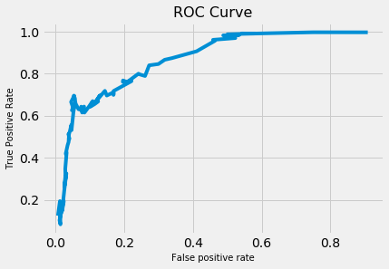
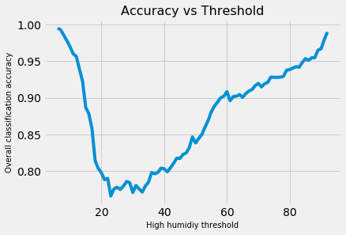

  🏠 Home
  🐍 Python

```python

print(sys.executable)
from IPython.core.interactiveshell import InteractiveShell
InteractiveShell.ast_node_interactivity = "all"
InteractiveShell.colors = "Linux"
InteractiveShell.separate_in = 0

import matplotlib.pyplot as plt

style.use('fivethirtyeight')
```
    /home/jcmint/anaconda3/envs/learningenv/bin/python
# Decision Tree 
Needed to install scikit-learn package with conda. 
```python
# Import libraries for decision tree

from sklearn.metrics import accuracy_score
from sklearn.metrics import confusion_matrix
from sklearn.model_selection import train_test_split
from sklearn.tree import DecisionTreeClassifier

# Import Data
data = pd.read_csv('Week-7-MachineLearning/weather/daily_weather.csv')
data.head()
```

|  | number | air_pressure_9am | air_temp_9am | avg_wind_direction_9am | avg_wind_speed_9am | max_wind_direction_9am | max_wind_speed_9am | rain_accumulation_9am | rain_duration_9am | relative_humidity_9am | relative_humidity_3pm |
| --- | --- | --- | --- | --- | --- | --- | --- | --- | --- | --- | --- |
| 0 | 0 | 918.060000 | 74.822000 | 271.100000 | 2.080354 | 295.400000 | 2.863283 | 0.0 | 0.0 | 42.420000 | 36.160000 |
| 1 | 1 | 917.347688 | 71.403843 | 101.935179 | 2.443009 | 140.471548 | 3.533324 | 0.0 | 0.0 | 24.328697 | 19.426597 |
| 2 | 2 | 923.040000 | 60.638000 | 51.000000 | 17.067852 | 63.700000 | 22.100967 | 0.0 | 20.0 | 8.900000 | 14.460000 |
| 3 | 3 | 920.502751 | 70.138895 | 198.832133 | 4.337363 | 211.203341 | 5.190045 | 0.0 | 0.0 | 12.189102 | 12.742547 |
| 4 | 4 | 921.160000 | 44.294000 | 277.800000 | 1.856660 | 136.500000 | 2.863283 | 8.9 | 14730.0 | 92.410000 | 76.740000 |

## Cleaning Data

* drop 'number' column
* drop NA rows
```python
clean_data = data.copy()
clean_data[clean_data.isnull().any(axis = 1)].head()
```

|  | number | air_pressure_9am | air_temp_9am | avg_wind_direction_9am | avg_wind_speed_9am | max_wind_direction_9am | max_wind_speed_9am | rain_accumulation_9am | rain_duration_9am | relative_humidity_9am | relative_humidity_3pm |
| --- | --- | --- | --- | --- | --- | --- | --- | --- | --- | --- | --- |
| 16 | 16 | 917.890000 | NaN | 169.200000 | 2.192201 | 196.800000 | 2.930391 | 0.0 | 0.0 | 48.990000 | 51.190000 |
| 111 | 111 | 915.290000 | 58.820000 | 182.600000 | 15.613841 | 189.000000 | NaN | 0.0 | 0.0 | 21.500000 | 29.690000 |
| 177 | 177 | 915.900000 | NaN | 183.300000 | 4.719943 | 189.900000 | 5.346287 | 0.0 | 0.0 | 29.260000 | 46.500000 |
| 262 | 262 | 923.596607 | 58.380598 | 47.737753 | 10.636273 | 67.145843 | 13.671423 | 0.0 | NaN | 17.990876 | 16.461685 |
| 277 | 277 | 920.480000 | 62.600000 | 194.400000 | 2.751436 | NaN | 3.869906 | 0.0 | 0.0 | 52.580000 | 54.030000 |

I will drop these rows for now. However, that isn't the only thing you can do with them (you could use linear interpolation since they are numeric and this is time series data with evenly spaces intervals)
```python
del clean_data['number']
clean_data = clean_data.dropna()
```
## Prep data for analysis
* Bin humidity values into low (0) and high (1) to make it a binary classification problem and store in `high_humidity_label`
* store bin labels as `y`
* Store training variables names into `morning_features`, then store training data into `x` 
* split `x` and `y` into training and testing subsets, `x_train`, `x_test`, `y_train`, `y_test`
```python
clean_data['high_humidity_label'] = (clean_data['relative_humidity_3pm'] >= 25)*1
clean_data[['high_humidity_label','relative_humidity_3pm']].head(8)
y=clean_data[['high_humidity_label']].copy()
morning_features = ['air_pressure_9am','air_temp_9am','avg_wind_direction_9am','avg_wind_speed_9am',
        'max_wind_direction_9am','max_wind_speed_9am','rain_accumulation_9am',
        'rain_duration_9am']
x = clean_data[morning_features].copy()
x_train, x_test, y_train, y_test = train_test_split(x, y, test_size=0.33, random_state=324).copy()
```

|  | high_humidity_label | relative_humidity_3pm |
| --- | --- | --- |
| 0 | 1 | 36.160000 |
| 1 | 0 | 19.426597 |
| 2 | 0 | 14.460000 |
| 3 | 0 | 12.742547 |
| 4 | 1 | 76.740000 |
| 5 | 1 | 33.930000 |
| 6 | 0 | 21.385657 |
| 7 | 1 | 74.920000 |

## Fit decision tree classifier and generate predictions
* Create decision tree object (object attributes passed)
* run decision tree method with training data
* run decision tree method with testing intput data
* look at results, calculate average accuracy
```python
humidity_classifier = DecisionTreeClassifier(max_leaf_nodes=10, random_state=0);
humidity_classifier.fit(x_train, y_train);
y_test.loc[:,'predictions'] = humidity_classifier.predict(x_test)
y_test.head(10)
(y_test.iloc[:,0] == y_test.iloc[:,1]).mean()
```
    DecisionTreeClassifier(class_weight=None, criterion='gini', max_depth=None,
                max_features=None, max_leaf_nodes=10,
                min_impurity_decrease=0.0, min_impurity_split=None,
                min_samples_leaf=1, min_samples_split=2,
                min_weight_fraction_leaf=0.0, presort=False, random_state=0,
                splitter='best')

|  | high_humidity_label | predictions |
| --- | --- | --- |
| 456 | 0 | 0 |
| 845 | 0 | 0 |
| 693 | 1 | 1 |
| 259 | 1 | 1 |
| 723 | 1 | 1 |
| 224 | 1 | 1 |
| 300 | 1 | 0 |
| 442 | 0 | 0 |
| 585 | 1 | 0 |
| 1057 | 1 | 1 |

    0.8153409090909091
## Extending the example
* I want to see how the 'threshold' for binning affects the classification accuracy (e.g. if the cutoff is closer to the mean then it should be less accurate)
* Instead of dropping the null values, linear impute and create a new variable to as a shadow variable (1 in this column means that another column was imputed)
* Iterate through random states for splitting into test and train sets (10 tries) - return vector of accuracy values
* refactor decision tree to a method to return vectors of classification accuracy and recall (true positive rate for the high humidity label) for  a specific threshold
```python
clean_data = data.copy()
clean_data.loc[clean_data.isnull().any(axis = 1),'Missing'] = 1
clean_data['Missing'] = clean_data['Missing'].fillna(0)
print("Number of interpolated values:", sum(clean_data['Missing']))
clean_data = clean_data.interpolate()
morning_features.append('Missing')
x = clean_data[morning_features].copy()
def tree_acc_recall(threshold):
    clean_data['high_humidity_label'] = (clean_data['relative_humidity_3pm'] >= threshold)*1
    y=clean_data[['high_humidity_label']]
    # x stays the same
    my_val = pd.DataFrame(columns = ['Accuracy', 'True Positives', 'False Positives'], index = range(0,20))
    for i in range(0,20): # 20 trials for each threshold
        x_train, x_test, y_train, y_test = train_test_split(x, y, test_size=0.33, random_state=randint(99,100000000))
        humidity_classifier = DecisionTreeClassifier(max_leaf_nodes=10, random_state=0);
        humidity_classifier.fit(x_train, y_train);
        y_test['predictions'] = humidity_classifier.predict(x_test)
        nums = confusion_matrix(y_test['high_humidity_label'], y_test['predictions']).ravel()
        if (len(nums) == 1):
            tn, fp, fn, tp = 1, 1, 1, 1
        else:
            tn, fp, fn, tp = nums
            my_val.iloc[[i],0] = (tp + tn)/(tn + fp + fn + tp)
            my_val.iloc[[i],1] = tp/(tp + fn)
            my_val.iloc[[i],2] = fp/(fp + tn)
        # Too many chained operations, too confusing
        #my_val.iloc[[i],0]  = (y_test.iloc[:,0] == y_test.iloc[:,1]).mean() # accuracy
        #my_val.iloc[[i],1] = ((y_test.iloc[:,1] == 1)&(y_test.iloc[:,0] == y_test.iloc[:,1])).sum()/(y_test.iloc[:,0].sum()) # true positive 
        #my_val.iloc[[i],2] = ((y_test.iloc[:,1] == 1)&(y_test.iloc[:,0] != y_test.iloc[:,1])).sum()/(y_test.iloc[:,0].sum()) # false positive
    return(my_val)
```
    Number of interpolated values: 31.0
```python
list(x)
```
    ['air_pressure_9am',
     'air_temp_9am',
     'avg_wind_direction_9am',
     'avg_wind_speed_9am',
     'max_wind_direction_9am',
     'max_wind_speed_9am',
     'rain_accumulation_9am',
     'rain_duration_9am',
     'Missing']
```python
%%capture
my_out = pd.DataFrame(columns = ['Humidity Threshold', 'Average Accuracy', 'Average True Positives', 'Average False Positives'], index = range(0,101))
k = 0
for i in range(0,101, 1):
    temp = tree_acc_recall(i)
    my_out.iloc[[k],0] = i
    my_out.iloc[[k],1] = temp['Accuracy'].mean()
    my_out.iloc[[k],2] = temp['True Positives'].mean()
    my_out.iloc[[k],3] = temp['False Positives'].mean()
    k+=1
```
```python
my_out.head(10)
my_out.tail(10)
```

|  | Humidity Threshold | Average Accuracy | Average True Positives | Average False Positives |
| --- | --- | --- | --- | --- |
| 0 | 0 | NaN | NaN | NaN |
| 1 | 1 | NaN | NaN | NaN |
| 2 | 2 | NaN | NaN | NaN |
| 3 | 3 | NaN | NaN | NaN |
| 4 | 4 | NaN | NaN | NaN |
| 5 | 5 | NaN | NaN | NaN |
| 6 | 6 | 0.994911 | 0.996361 | 0.909091 |
| 7 | 7 | 0.99294 | 0.996611 | 0.75 |
| 8 | 8 | 0.985221 | 0.992595 | 0.637024 |
| 9 | 9 | 0.977901 | 0.990382 | 0.576939 |

|  | Humidity Threshold | Average Accuracy | Average True Positives | Average False Positives |
| --- | --- | --- | --- | --- |
| 91 | 91 | 0.979282 | 0.194167 | 0.0124086 |
| 92 | 92 | 0.989677 | 0.125 | 0.00670898 |
| 93 | 93 | NaN | NaN | NaN |
| 94 | 94 | NaN | NaN | NaN |
| 95 | 95 | NaN | NaN | NaN |
| 96 | 96 | NaN | NaN | NaN |
| 97 | 97 | NaN | NaN | NaN |
| 98 | 98 | NaN | NaN | NaN |
| 99 | 99 | NaN | NaN | NaN |
| 100 | 100 | NaN | NaN | NaN |

## ROC Curve 
* `my_out` has NaN when it is dividing by 0, when the threshold is so high that there are no true or false positives 
```python
fig, axis = plt.subplots()
axis.yaxis.grid(True)
axis.set_title('ROC Curve',fontsize=16)
axis.set_xlabel('False positive rate',fontsize=10)
axis.set_ylabel('True Positive Rate',fontsize=10)
axis.plot(my_out.iloc[:,3], my_out.iloc[:,2])
plt.show();
```

## Classification accuracy vs Threshold for classifying as high humidity
```python
fig, axis = plt.subplots()
axis.yaxis.grid(True)
axis.set_title('Accuracy vs Threshold',fontsize=16)
axis.set_xlabel('High humidiy threshold',fontsize=10)
axis.set_ylabel('Overall classification accuracy',fontsize=10)
axis.plot(my_out.iloc[:,0], my_out.iloc[:,1])
plt.show();
```
