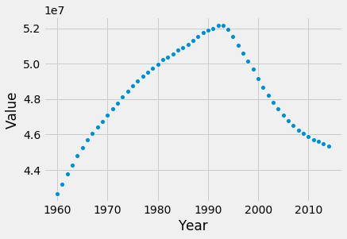

  🏠 Home
  🐍 Python

```python

print(sys.executable)
from IPython.core.interactiveshell import InteractiveShell
InteractiveShell.ast_node_interactivity = "all"
InteractiveShell.colors = "Linux"
InteractiveShell.separate_in = 0

import matplotlib.pyplot as plt

style.use('fivethirtyeight')

from sklearn.tree import DecisionTreeRegressor
from sklearn.linear_model import LinearRegression
from sklearn.model_selection import train_test_split
from sklearn.metrics import mean_squared_error, r2_score

from plotnine import ggplot, geom_histogram, aes
```
    /home/jcmint/anaconda3/envs/learningenv/bin/python
# Linear and Decision Tree Regression
Linear model and decision tree regression seem pretty straightforward. 
Here I want to see if the RMSE is decreased for a regression model based on 1960 through 2014 data that is predicting `Population, total` as a function of all other variables. I would need to filter by year, drop all but three columns (country, indicator type and value) and pivot the table on the country name to get a wide data set. This can be fed directly into the linear regression model. 
Then, iterate through random training and testing data split to get a distribution of RMSE values. Graph the RMSE of as the prediction error vs year on the x axis.  
This exercise was somewhat contrived, and I ended up using a simple time series manipulation of the data for demonstration purposes. 
```python
indicators = pd.read_csv('../../../../data/w5vis/Indicators.csv')
```
```python
indicators.head()
```

|  | CountryName | CountryCode | IndicatorName | IndicatorCode | Year | Value |
| --- | --- | --- | --- | --- | --- | --- |
| 0 | Arab World | ARB | Adolescent fertility rate (births per 1,000 wo... | SP.ADO.TFRT | 1960 | 1.335609e+02 |
| 1 | Arab World | ARB | Age dependency ratio (% of working-age populat... | SP.POP.DPND | 1960 | 8.779760e+01 |
| 2 | Arab World | ARB | Age dependency ratio, old (% of working-age po... | SP.POP.DPND.OL | 1960 | 6.634579e+00 |
| 3 | Arab World | ARB | Age dependency ratio, young (% of working-age ... | SP.POP.DPND.YG | 1960 | 8.102333e+01 |
| 4 | Arab World | ARB | Arms exports (SIPRI trend indicator values) | MS.MIL.XPRT.KD | 1960 | 3.000000e+06 |

|  | CountryName | IndicatorName | Value |
| --- | --- | --- | --- |
| 4839015 | Arab World | Access to electricity (% of population) | 84.342225 |
| 4839016 | Arab World | Access to electricity, rural (% of rural popul... | 71.969903 |
| 4839017 | Arab World | Access to electricity, urban (% of urban popul... | 93.828463 |
| 4839018 | Arab World | Access to non-solid fuel (% of population) | 86.003666 |
| 4839019 | Arab World | Access to non-solid fuel, rural (% of rural po... | 74.552598 |

```python
%%capture
# preallocate dataframe
output = pd.DataFrame(columns = ['Year', 'Amount of Data', 'RMSE Average', 'R Squared Average'], index = range(0, 2015 - 1960))
j = 0;
# Calculate RMSE for each regression model based on year
for i in range(1960, 2015, 1):
    test = indicators.copy()
    test = test[test['Year'] == i]
    del test['CountryCode']
    del test['IndicatorCode']
    del test['Year']
    wide = test.pivot(index='CountryName', columns='IndicatorName', values='Value')
    wide = wide[~wide['Population, total'].isna()]# drop any rows missing the target variable - this ensures that I won't drop the column by accident later..
    wide = wide.dropna(axis = 1, thresh = 0.85*len(wide))
    wide = wide.dropna(axis = 0, how = "any")
    #print("Year: ", i, "; Remaining rows and columns", wide.shape, "; Total amount of data: ", wide.shape[0] * wide.shape[1], "; Any Missing data? ", wide.isnull().values.any())

    x = wide.loc[:, wide.columns != 'Population, total']
    y = wide['Population, total']

    RMSE = [None] * 10
    r2 = [None] * 10

    for k in range(0, 10, 1):
        x_train, x_test, y_train, y_test = train_test_split(x, y, test_size=0.33, random_state=randint(0,1000000));
        regressor = LinearRegression();
        regressor.fit(x_train, y_train);
        y_prediction = regressor.predict(x_test);
        RMSE[k] = sqrt(mean_squared_error(y_true = y_test, y_pred = y_prediction));
        r2[k] = r2_score(y_true = y_test, y_pred = y_prediction)
    output.iloc[j, 0] = i
    output.iloc[j, 1] = wide.shape[0] * wide.shape[1]
    output.iloc[j, 2] = sum(RMSE)/len(RMSE)
    output.iloc[j, 3] = sum(r2)/len(r2)
    j+=1
```
I tested the processing of data by year to get rid of NA values. When iterating through the available years I want to 
```python
output.head()
```

|  | Year | Amount of Data | RMSE Average | R Squared Average |
| --- | --- | --- | --- | --- |
| 0 | 1960 | 2254 | 9.11015e+07 | 0.036731 |
| 1 | 1961 | 2688 | 1.01918e+08 | 0.877477 |
| 2 | 1962 | 3330 | 1.35075e+08 | 0.853944 |
| 3 | 1963 | 3162 | 4.26152e+08 | -2.74594 |
| 4 | 1964 | 3162 | 4.32376e+08 | -2.71138 |

After being stumped for a while, I realized what I was doing wrong. This was a somewhat silly example because there are many columns which may be 100% colinear with the `Population, total` column. 
```python
test = indicators.copy()
test = test[test['Year'] == i]
del test['CountryCode']
del test['IndicatorCode']
del test['Year']
wide = test.pivot(index='CountryName', columns='IndicatorName', values='Value')
wide.columns[wide.columns.str.contains("pop")][0:10]
len(wide.columns[wide.columns.str.contains("pop")])
```
    Index(['Adult literacy rate, population 15+ years, both sexes (%)',
           'Adult literacy rate, population 15+ years, female (%)',
           'Adult literacy rate, population 15+ years, male (%)',
           'Age dependency ratio (% of working-age population)',
           'Age dependency ratio, old (% of working-age population)',
           'Age dependency ratio, young (% of working-age population)',
           'Annualized average growth rate in per capita real survey mean consumption or income, bottom 40% of population (%)',
           'Annualized average growth rate in per capita real survey mean consumption or income, total population (%)',
           'Condom use, population ages 15-24, female (% of females ages 15-24)',
           'Condom use, population ages 15-24, male (% of males ages 15-24)'],
          dtype='object', name='IndicatorName')
    63
Therefore, I need to drop these rows to make my example actually 'predict' values.
```python
%%capture
# preallocate dataframe
output = pd.DataFrame(columns = ['Year', 'Amount of Data', 'RMSE Average', 'R Squared Average'], index = range(0, 2015 - 1960))
j = 0;
# Calculate RMSE for each regression model based on year
for i in range(1960, 2015, 1):
    test = indicators.copy()
    test = test[test['Year'] == i]
    del test['CountryCode']
    del test['IndicatorCode']
    del test['Year']
    wide = test.pivot(index='CountryName', columns='IndicatorName', values='Value')

    wide = wide[~wide['Population, total'].isna()]# drop any rows missing the target variable - this ensures that I won't drop the column by accident later..
    wide = wide.dropna(axis = 1, thresh = 0.85*len(wide))
    wide = wide.dropna(axis = 0, how = "any")
    #print("Year: ", i, "; Remaining rows and columns", wide.shape, "; Total amount of data: ", wide.shape[0] * wide.shape[1], "; Any Missing data? ", wide.isnull().values.any())

    y = wide['Population, total']
    # Drop potentially colinear variables (my guess)
    wide = wide[wide.columns.drop(list(wide.filter(regex='pop')))]
    wide = wide[wide.columns.drop(list(wide.filter(regex='Pop')))]
    x = wide.loc[:, wide.columns != 'Population, total']   

    RMSE = [None] * 10
    r2 = [None] * 10

    for k in range(0, 10, 1):
        x_train, x_test, y_train, y_test = train_test_split(wide, y, test_size=0.33, random_state=324);
        regressor = LinearRegression();
        regressor.fit(x_train, y_train);
        y_prediction = regressor.predict(x_test);
        RMSE[k] = sqrt(mean_squared_error(y_true = y_test, y_pred = y_prediction));
        r2[k] = r2_score(y_true = y_test, y_pred = y_prediction)
    output.iloc[j, 0] = i
    output.iloc[j, 1] = wide.shape[0] * wide.shape[1]
    output.iloc[j, 2] = sum(RMSE)/len(RMSE)
    output.iloc[j, 3] = sum(r2)/len(r2)
    j+=1
```
Trying to get this example to work may be too contrived without manual PCA or feature selection, so I decided to just try another approach - generate a linear regression model for each country as a function of year.
```python
%%capture
countries = indicators['CountryName'].unique().tolist()
output = pd.DataFrame(columns = ['Country', 'RMSE Average', 'R Squared Average'], index = range(0, len(countries) + 1))
k = 0
for i in countries:
    wide = indicators.copy()
    del wide['CountryCode']
    del wide['IndicatorCode']
    cond_1 = wide['CountryName'] == i
    cond_2 = wide['IndicatorName'] == 'Population, total'
    wide = wide[cond_1 & cond_2]
    del wide['IndicatorName']

    RMSE = [None] * 10
    r2 = [None] * 10

    for j in range(0, 10, 1):
        x_train, x_test, y_train, y_test = train_test_split(pd.DataFrame(wide['Year']), pd.DataFrame(wide['Value']), test_size=0.33, random_state=randint(0,1000000))
        regressor = LinearRegression();
        regressor.fit(x_train, y_train);
        y_prediction = regressor.predict(x_test);
        RMSE[j] = sqrt(mean_squared_error(y_true = y_test, y_pred = y_prediction));
        r2[j] = r2_score(y_true = y_test, y_pred = y_prediction)

    output.iloc[k, 0] = i
    output.iloc[k, 1] = sum(RMSE)/len(RMSE)
    output.iloc[k, 2] = sum(r2)/len(r2)
    k+=1
```
```python
output.head()
output = output.dropna()
output.sort_values('R Squared Average').head()
from scipy.stats import describe
describe(output['R Squared Average'])
```

|  | Country | RMSE Average | R Squared Average |
| --- | --- | --- | --- |
| 0 | Arab World | 1.19366e+07 | 0.981009 |
| 1 | Caribbean small states | 80474.8 | 0.990475 |
| 2 | Central Europe and the Baltics | 4.43389e+06 | 0.236114 |
| 3 | East Asia &amp; Pacific (all income levels) | 3.7243e+07 | 0.989137 |
| 4 | East Asia &amp; Pacific (developing only) | 3.27897e+07 | 0.991255 |

|  | Country | RMSE Average | R Squared Average |
| --- | --- | --- | --- |
| 201 | Sint Maarten (Dutch part) | 2924.69 | -0.297575 |
| 210 | St. Kitts and Nevis | 4084.1 | -0.19532 |
| 80 | Croatia | 163570 | -0.150368 |
| 145 | Lithuania | 272980 | -0.14565 |
| 94 | Estonia | 92947.5 | -0.117783 |

    DescribeResult(nobs=247, minmax=(-0.29757490589067603, 0.9996578791364774), mean=0.8691825934749658, variance=0.06901810751504184, skewness=-2.9841692292997424, kurtosis=8.029106379317444)
Running the code ended up taking about 10 minutes for 2460 linear regression models. I also graph the pop for a random country with a negative r2 value.
```python
wide = indicators.copy()
del wide['CountryCode']
del wide['IndicatorCode']
cond_1 = wide['CountryName'] == 'Ukraine'
cond_2 = wide['IndicatorName'] == 'Population, total'
wide = wide[cond_1 & cond_2]
del wide['IndicatorName']
sns.scatterplot(x = 'Year', y='Value', data  = wide)
```


```python
```