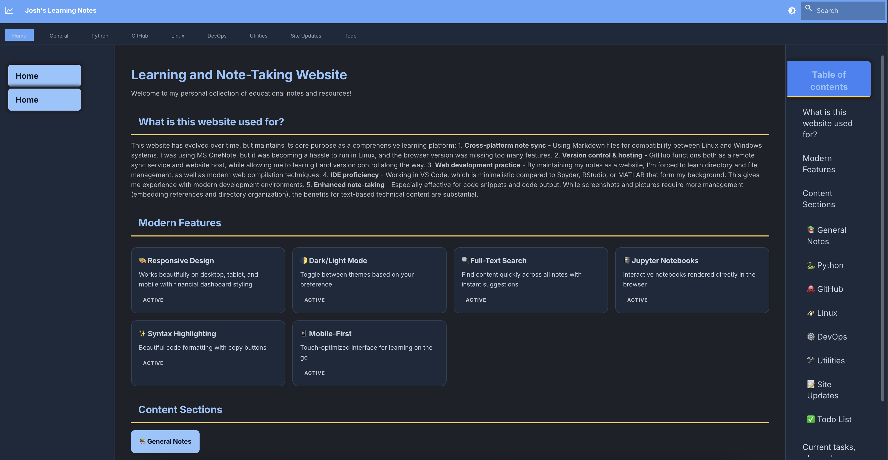

[🏠 Back to Home](../)

[📋 Back to Site Updates Portal](base)

# August 28, 2025

After a long break from this site we have some major overhauls of the style and layout of the website, making the best use of the github pages static hosting capabilities.

Additions:

- docusaurus build tools
- AI (cursor) to manage conversion process
- extensive cursor rules to enforce high quality build pipelines. If we convert from `.ipynb` or `.py` -> `.md` and then `.md` -> `.html`, make sure all the pages can be built without errors.

In June 2019, the page looked like this:

v1 using mkdocs looked like this:

Final version is just a bit more refined, but I could probably achieved the same thing with mkdocs
