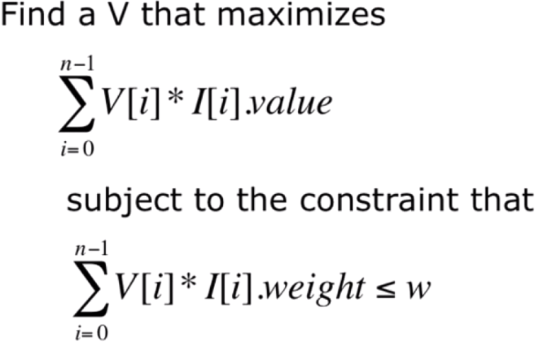

<a href="../../../index.html">Go back to index</a>

<a href="../base.html">Go back to Python Portal</a>
<head>
  <link rel="stylesheet" href="../../../cssthemes/github.css">
</head>

# Optimization models & the Knapsack problem

* Objective function to maximize or minimize
* Constraints 
* Often just approximate a solution with a greedy algorithm

## Knapsack problem

In the knapsack problem, you have a capacity and have to decide how to fill it. Discrete contents are harder than continuous ones. 

* Each item is a pair of value and weight
* Knapsack has a total capacity, *w* 
* A set of available items
* A list indicating whether an item has already been taken
* For each item in available items, choose those to take and multiply it by its value.
* The sum of chosen items' weights is less than *w*



## Brute force algorithm

* Try every possible combination (every subset of subject set), remove those not under *w*, and choose the remaining with highest value. 
  * The algorithm is exponential, having 2^n complexity
  * Find approximate and optimal solutions

## Greedy algorithm

* while the knapsack is not full, put the best available item in. 
* nlog(n) complexity

What does 'best' mean? Based on the highest value, lowest weight, or the ratio? 

```python
def greedy(items, maxCost, keyFunction):
    """Assumes items a list, maxCost >= 0,
         keyFunction maps elements of items to numbers"""
    itemsCopy = sorted(items, key = keyFunction,
                       reverse = True)
    result = []
    totalValue, totalCost = 0.0, 0.0
    for i in range(len(itemsCopy)):
        if (totalCost+itemsCopy[i].getCost()) <= maxCost:
            result.append(itemsCopy[i])
            totalCost += itemsCopy[i].getCost()
            totalValue += itemsCopy[i].getValue()
    return (result, totalValue)
```

Using the lambda function:
```python
f = lambda x, y: 'yes' if (x%y == 0) else 'no'
f(1, 2)
'no'
f(2, 2)
'yes'
```

The keyfunction will define how the greedy algorithm makes choices. Different answers will result since locally optimal choices won't necessarily yield globally optimal solutions. 
* especially seen in local optima
* performance will depend on constraints

# Decision trees and dynamic programming

* Select from the list of available items
* If an item fits, a node represents the decision to take (left) or not to take (right) that item. 
* Recursively apply to nonleaf children
* complexity is exponential, 2^n

```python
def maxVal(toConsider, avail):
"""Assumes toConsider a list of items, avail a weight
Returns a tuples of the total value of a solution to the 0/1 knapsack
problem and the items of that solution"""
if toConsider == [] or avail == 0:
    result = (0, ())
elif toConsider[0].getCost() > avail:
    # Explore right branch only
    result = maxVal(toConsider[1:], avail)
else:
    nextItem = toConsider[0]
    # Explore left branch
    withVal, withToTake = maxVal(toConsider[1:], avail - nextItem.getCost())
    withVal += nextItem.getValue()
    # Explore right branch
    withoutVal, withoutToTake = maxVal(toConsider[1:], avail)
    # Explore better branch
    if withVal > withoutVal:
        result = (withVal, withToTake + (nextItem,))
    else:
        result = (withoutVal, withoutToTake)
return result
```

* Consider the first item - if it exceeds the available space, recursively call itself to consider the rest of thelist
* Else - consider the cases where the item is **taken** or **not taken**; in both cases the item is **removed** from the items to take (`toConsider[1:]`).
* If the item is **taken**, then call the function recursively with the avaiable space minus that of the taken item (`avail - nextItem.getUnits()`).
* If the item is **not taken**, call the function recursively with the same available space, `avail`. 
* Finally, evaluate both branches for the better outcome. 
* Return `result`, a tuple of the value in a set, and a list of the items in a set. This is the best solution thus far. 

