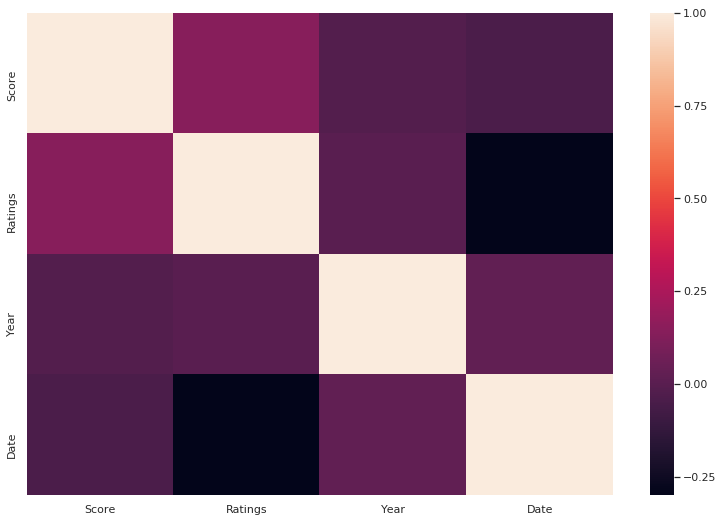
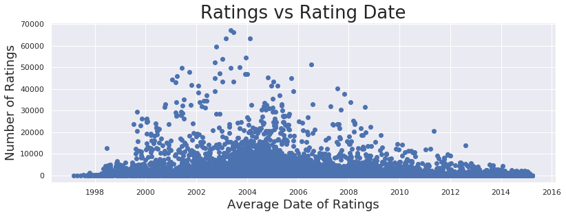
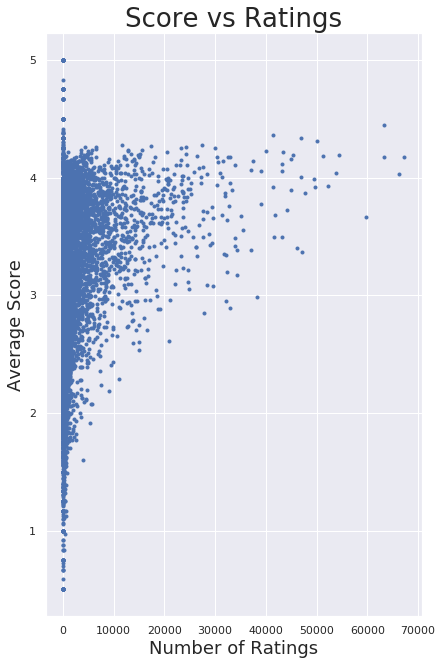

<a href="../../../index.html">Go back to index</a>

<a href="../base.html">Go back to Python Portal</a>
<head>
  <link rel="stylesheet" href="../../../cssthemes/github.css">
</head>


```python
import sys
print(sys.executable)
from IPython.core.interactiveshell import InteractiveShell
InteractiveShell.ast_node_interactivity = "all"
InteractiveShell.colors = "Linux"
InteractiveShell.separate_in = 0


```

    /home/jcmint/anaconda3/envs/learningenv/bin/python


# Clustering - kmeans

The clustering tutorial was based on weather data and classifying them into hot or cold days based on 7-8 features. However, I wanted to try something on my own using the movies rating data. I wanted to 2-D graph movies by the number of raters and the average score, and plot. Then, I would use a third variable (the decade it was released) to color the points, to see if movies released in certain decades were more actively reviewed or had higher. A fourth variable, the average review timestamp, would be used as intensity for a heatmap for the color variable. 

After assessing the data, I would then run the data through a cluster algoritm, including generating an elbow curve. 

Installed seaborn from conda for leanringenv


```python
from sklearn.preprocessing import StandardScaler
from sklearn.cluster import KMeans
import pandas as pd
import numpy as np
from itertools import cycle, islice
import matplotlib.pyplot as plt
from matplotlib import style
import seaborn as sns
sns.set(style="ticks", context="talk")


```


```python
movies = pd.read_csv('../../../../data/w4pd/movies.csv')
ratings = pd.read_csv('../../../../data/w4pd/ratings.csv')
```


```python
movies.shape, ratings.shape
movies.head()
ratings.head()
```


    ((27278, 3), (20000263, 4))


<div>
<style scoped>
    .dataframe tbody tr th:only-of-type {
        vertical-align: middle;
    }

    .dataframe tbody tr th {
        vertical-align: top;
    }

    .dataframe thead th {
        text-align: right;
    }
</style>
<table border="1" class="dataframe">
  <thead>
    <tr style="text-align: right;">
      <th></th>
      <th>movieId</th>
      <th>title</th>
      <th>genres</th>
    </tr>
  </thead>
  <tbody>
    <tr>
      <th>0</th>
      <td>1</td>
      <td>Toy Story (1995)</td>
      <td>Adventure|Animation|Children|Comedy|Fantasy</td>
    </tr>
    <tr>
      <th>1</th>
      <td>2</td>
      <td>Jumanji (1995)</td>
      <td>Adventure|Children|Fantasy</td>
    </tr>
    <tr>
      <th>2</th>
      <td>3</td>
      <td>Grumpier Old Men (1995)</td>
      <td>Comedy|Romance</td>
    </tr>
    <tr>
      <th>3</th>
      <td>4</td>
      <td>Waiting to Exhale (1995)</td>
      <td>Comedy|Drama|Romance</td>
    </tr>
    <tr>
      <th>4</th>
      <td>5</td>
      <td>Father of the Bride Part II (1995)</td>
      <td>Comedy</td>
    </tr>
  </tbody>
</table>
</div>


<div>
<style scoped>
    .dataframe tbody tr th:only-of-type {
        vertical-align: middle;
    }

    .dataframe tbody tr th {
        vertical-align: top;
    }

    .dataframe thead th {
        text-align: right;
    }
</style>
<table border="1" class="dataframe">
  <thead>
    <tr style="text-align: right;">
      <th></th>
      <th>userId</th>
      <th>movieId</th>
      <th>rating</th>
      <th>timestamp</th>
    </tr>
  </thead>
  <tbody>
    <tr>
      <th>0</th>
      <td>1</td>
      <td>2</td>
      <td>3.5</td>
      <td>1112486027</td>
    </tr>
    <tr>
      <th>1</th>
      <td>1</td>
      <td>29</td>
      <td>3.5</td>
      <td>1112484676</td>
    </tr>
    <tr>
      <th>2</th>
      <td>1</td>
      <td>32</td>
      <td>3.5</td>
      <td>1112484819</td>
    </tr>
    <tr>
      <th>3</th>
      <td>1</td>
      <td>47</td>
      <td>3.5</td>
      <td>1112484727</td>
    </tr>
    <tr>
      <th>4</th>
      <td>1</td>
      <td>50</td>
      <td>3.5</td>
      <td>1112484580</td>
    </tr>
  </tbody>
</table>
</div>


Now I want to group the ratings


```python
movie_ratings = ratings[['movieId', 'rating']].groupby('movieId').mean() 
movie_counts = ratings[['movieId', 'rating']].groupby('movieId').count() 
movie_timestamps = pd.to_datetime(ratings[['movieId', 'timestamp']].groupby('movieId').mean()['timestamp'], unit = 's').dt.date

```


```python
print("Timestamp range is ", movie_timestamps.min(), " to ", movie_timestamps.max())
```

    Timestamp range is  1997-03-02  to  2015-03-30


Join all three on Movie ID


```python
merged_1 = movie_ratings.merge(movie_counts, on = 'movieId', how='inner').merge(movie_timestamps, on = 'movieId', how='inner')
merged_1 = merged_1.merge(movies[['movieId', 'title']], on = 'movieId', how='inner')
merged_1.head()
```


<div>
<style scoped>
    .dataframe tbody tr th:only-of-type {
        vertical-align: middle;
    }

    .dataframe tbody tr th {
        vertical-align: top;
    }

    .dataframe thead th {
        text-align: right;
    }
</style>
<table border="1" class="dataframe">
  <thead>
    <tr style="text-align: right;">
      <th></th>
      <th>movieId</th>
      <th>rating_x</th>
      <th>rating_y</th>
      <th>timestamp</th>
      <th>title</th>
    </tr>
  </thead>
  <tbody>
    <tr>
      <th>0</th>
      <td>1</td>
      <td>3.921240</td>
      <td>49695</td>
      <td>2003-05-11</td>
      <td>Toy Story (1995)</td>
    </tr>
    <tr>
      <th>1</th>
      <td>2</td>
      <td>3.211977</td>
      <td>22243</td>
      <td>2002-11-18</td>
      <td>Jumanji (1995)</td>
    </tr>
    <tr>
      <th>2</th>
      <td>3</td>
      <td>3.151040</td>
      <td>12735</td>
      <td>2000-05-30</td>
      <td>Grumpier Old Men (1995)</td>
    </tr>
    <tr>
      <th>3</th>
      <td>4</td>
      <td>2.861393</td>
      <td>2756</td>
      <td>1999-04-15</td>
      <td>Waiting to Exhale (1995)</td>
    </tr>
    <tr>
      <th>4</th>
      <td>5</td>
      <td>3.064592</td>
      <td>12161</td>
      <td>2000-06-26</td>
      <td>Father of the Bride Part II (1995)</td>
    </tr>
  </tbody>
</table>
</div>


Next, extract the year from the title and bin into a decade 


```python
Title[['Name']], Year[['Year']] = merged_1['title'].str.extract('(.+?) \('), merged_1['title'].str.extract('(\d\d\d\d)')

merged_1 = pd.concat([merged_1, Title['Name'], Year['Year']], axis = 1, join = "inner")
merged_1.head()
```


<div>
<style scoped>
    .dataframe tbody tr th:only-of-type {
        vertical-align: middle;
    }

    .dataframe tbody tr th {
        vertical-align: top;
    }

    .dataframe thead th {
        text-align: right;
    }
</style>
<table border="1" class="dataframe">
  <thead>
    <tr style="text-align: right;">
      <th></th>
      <th>movieId</th>
      <th>rating_x</th>
      <th>rating_y</th>
      <th>timestamp</th>
      <th>title</th>
      <th>Name</th>
      <th>Year</th>
    </tr>
  </thead>
  <tbody>
    <tr>
      <th>0</th>
      <td>1</td>
      <td>3.921240</td>
      <td>49695</td>
      <td>2003-05-11</td>
      <td>Toy Story (1995)</td>
      <td>Toy Story</td>
      <td>1995</td>
    </tr>
    <tr>
      <th>1</th>
      <td>2</td>
      <td>3.211977</td>
      <td>22243</td>
      <td>2002-11-18</td>
      <td>Jumanji (1995)</td>
      <td>Jumanji</td>
      <td>1995</td>
    </tr>
    <tr>
      <th>2</th>
      <td>3</td>
      <td>3.151040</td>
      <td>12735</td>
      <td>2000-05-30</td>
      <td>Grumpier Old Men (1995)</td>
      <td>Grumpier Old Men</td>
      <td>1995</td>
    </tr>
    <tr>
      <th>3</th>
      <td>4</td>
      <td>2.861393</td>
      <td>2756</td>
      <td>1999-04-15</td>
      <td>Waiting to Exhale (1995)</td>
      <td>Waiting to Exhale</td>
      <td>1995</td>
    </tr>
    <tr>
      <th>4</th>
      <td>5</td>
      <td>3.064592</td>
      <td>12161</td>
      <td>2000-06-26</td>
      <td>Father of the Bride Part II (1995)</td>
      <td>Father of the Bride Part II</td>
      <td>1995</td>
    </tr>
  </tbody>
</table>
</div>


Finally, drop the title column since it's been split


```python
del merged_1['title']
merged_1 = merged_1.rename(columns={merged_1.columns[1]: "Score", merged_1.columns[2] : "Ratings", merged_1.columns[3]:"Date"})
merged_1.head()
```


<div>
<style scoped>
    .dataframe tbody tr th:only-of-type {
        vertical-align: middle;
    }

    .dataframe tbody tr th {
        vertical-align: top;
    }

    .dataframe thead th {
        text-align: right;
    }
</style>
<table border="1" class="dataframe">
  <thead>
    <tr style="text-align: right;">
      <th></th>
      <th>movieId</th>
      <th>Score</th>
      <th>Ratings</th>
      <th>Date</th>
      <th>Name</th>
      <th>Year</th>
    </tr>
  </thead>
  <tbody>
    <tr>
      <th>0</th>
      <td>1</td>
      <td>3.921240</td>
      <td>49695</td>
      <td>2003-05-11</td>
      <td>Toy Story</td>
      <td>1995</td>
    </tr>
    <tr>
      <th>1</th>
      <td>2</td>
      <td>3.211977</td>
      <td>22243</td>
      <td>2002-11-18</td>
      <td>Jumanji</td>
      <td>1995</td>
    </tr>
    <tr>
      <th>2</th>
      <td>3</td>
      <td>3.151040</td>
      <td>12735</td>
      <td>2000-05-30</td>
      <td>Grumpier Old Men</td>
      <td>1995</td>
    </tr>
    <tr>
      <th>3</th>
      <td>4</td>
      <td>2.861393</td>
      <td>2756</td>
      <td>1999-04-15</td>
      <td>Waiting to Exhale</td>
      <td>1995</td>
    </tr>
    <tr>
      <th>4</th>
      <td>5</td>
      <td>3.064592</td>
      <td>12161</td>
      <td>2000-06-26</td>
      <td>Father of the Bride Part II</td>
      <td>1995</td>
    </tr>
  </tbody>
</table>
</div>


I need to actually hold onto the POSIX average rating timestamps so that I can convert them to numbers for analysis. 


```python
scaled_1 = merged_1.copy()
del scaled_1['Name']
del scaled_1['Date']
scaled_1 = scaled_1.merge(ratings[['movieId', 'timestamp']].groupby('movieId').mean().astype(int), on = 'movieId', how='inner') 
del scaled_1['movieId']
scaled_1 = scaled_1.rename(columns={scaled_1.columns[3]: "Date"})
scaled_1.head()
```


<div>
<style scoped>
    .dataframe tbody tr th:only-of-type {
        vertical-align: middle;
    }

    .dataframe tbody tr th {
        vertical-align: top;
    }

    .dataframe thead th {
        text-align: right;
    }
</style>
<table border="1" class="dataframe">
  <thead>
    <tr style="text-align: right;">
      <th></th>
      <th>Score</th>
      <th>Ratings</th>
      <th>Year</th>
      <th>Date</th>
    </tr>
  </thead>
  <tbody>
    <tr>
      <th>0</th>
      <td>3.921240</td>
      <td>49695</td>
      <td>1995</td>
      <td>1052654098</td>
    </tr>
    <tr>
      <th>1</th>
      <td>3.211977</td>
      <td>22243</td>
      <td>1995</td>
      <td>1037616295</td>
    </tr>
    <tr>
      <th>2</th>
      <td>3.151040</td>
      <td>12735</td>
      <td>1995</td>
      <td>959648019</td>
    </tr>
    <tr>
      <th>3</th>
      <td>2.861393</td>
      <td>2756</td>
      <td>1995</td>
      <td>924214411</td>
    </tr>
    <tr>
      <th>4</th>
      <td>3.064592</td>
      <td>12161</td>
      <td>1995</td>
      <td>962016085</td>
    </tr>
  </tbody>
</table>
</div>


```python
%%capture
scaled_1['Year'] = pd.to_numeric(scaled_1['Year'])
var_corr = scaled_1.corr()
normalized = StandardScaler().fit_transform(scaled_1)
```

Finally, we can graph our data


```python
sns.heatmap(var_corr)
```


    <matplotlib.axes._subplots.AxesSubplot at 0x7f7a67318c88>





```python
fig, axis = plt.subplots()
fig.set_size_inches(11.7, 4)
axis.set_title('Ratings vs Rating Date',fontsize=26)
axis.set_xlabel('Average Date of Ratings',fontsize=18)
axis.set_ylabel('Number of Ratings',fontsize=18)
plt.plot_date(x='Date', y = 'Ratings', data = merged_1)
plt.show();

fig, axis = plt.subplots()
fig.set_size_inches(6, 10)
axis.set_title('Score vs Ratings',fontsize=26)
axis.set_xlabel('Number of Ratings',fontsize=18)
axis.set_ylabel('Average Score',fontsize=18)
plt.scatter(x='Ratings', y = 'Score', marker = '.', data = merged_1)
plt.show();
```








What's next?

* Bin 'Year' column into decades so I can color by the different buckets. Use this to compare to the clusters generated by kmeans clustering (color by either classification and compare side by side)
* Since I'm already familiar with ggplot, I would want to try to use [python ggplot](https://github.com/has2k1/plotnine) to color and facet by categorical variable and see if I can do something with it
